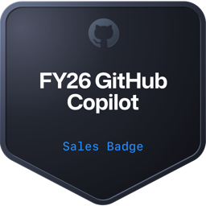
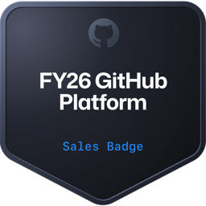

# Hi, I'm Evan Allen  

[](https://www.linkedin.com/in/evanallen13)
[](https://github.com/evanallen13)
[](mailto:/evanallen13@gmail.com)

[](https://github.com/MandalAutomations)
[](https://medium.com/@evanallen13)

---

# GitHub, DevOps & Platform Engineering Consultant

I help organizations modernize their software delivery by designing secure, scalable GitHub platforms and guiding teams through complex migrations, CI/CD modernization, and developer enablement.

My focus areas include:

- GitHub Enterprise Cloud & Enterprise Managed Users (EMU)
- GitHub Actions and CI/CD modernization
- GitHub Advanced Security enablement
- Azure DevOps, GitLab, Bitbucket, and SVN migrations
- Platform engineering, governance, and repository standards
- Copilot adoption and AI-assisted developer workflows

---

### Certifications  

<div id="certifications" align="left">
    
    
    
    
    
    
    
    
    
    
    
    
    
    
    
    
    
</div>

---

## What I Do

### GitHub Enterprise & Platform Strategy
- Design and implement GitHub Enterprise Cloud environments for large organizations
- Lead GitHub Enterprise Cloud → EMU migration planning and adoption
- Build governance models using repository rulesets, custom properties, branch protections, and automation
- Create scalable standards for enterprise repository management, identity, and access
- Help organizations establish secure developer platforms with repeatable best practices

### GitHub Actions & CI/CD Modernization
- Architect GitHub Actions workflows and reusable automation patterns
- Migrate pipelines from Azure DevOps, GitLab CI, Jenkins, Bitbucket, and other legacy systems
- Build secure release pipelines with environments, approvals, secrets, and deployment gates
- Develop custom GitHub Actions, composite actions, and migration tooling
- Improve developer productivity through faster, more reliable automation

### AI & Developer Productivity
- Help teams adopt GitHub Copilot effectively and responsibly
- Build local AI-assisted tooling for software modernization and migration scenarios
- Explore local Meta Llama workflows that convert GitLab CI pipelines into GitHub Actions workflows while keeping all data on-device

### GitHub Advanced Security & DevSecOps
- Deliver GitHub Advanced Security enablement and training
- Implement code scanning, secret scanning, Dependabot, and security governance
- Create enterprise-wide playbooks for GitHub Advanced Security rollout
- Design policy-driven security automation using repository metadata and custom properties

---

## Impact

- Migrated 10,000+ repositories from Azure DevOps, GitLab, Bitbucket, and SVN to GitHub
- Delivered GitHub training and enablement sessions to 500+ developers, administrators, and platform teams
- Designed enterprise governance standards for GitHub Enterprise Cloud and EMU environments
- Built and optimized CI/CD pipelines that improved release speed, consistency, and security
- Reduced Azure cloud costs by 15% through infrastructure optimization and automation

---

## Technical Expertise

```text
GitHub Enterprise Cloud | EMU | GitHub Actions | GitHub Advanced Security
GitHub Copilot | Codespaces | Azure DevOps | GitLab | Bitbucket | SVN
Azure | Kubernetes | Docker | Terraform | Python | PowerShell
GraphQL | REST APIs | CI/CD | DevSecOps | Platform Engineering
```

---
